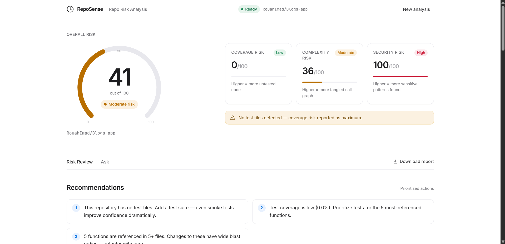
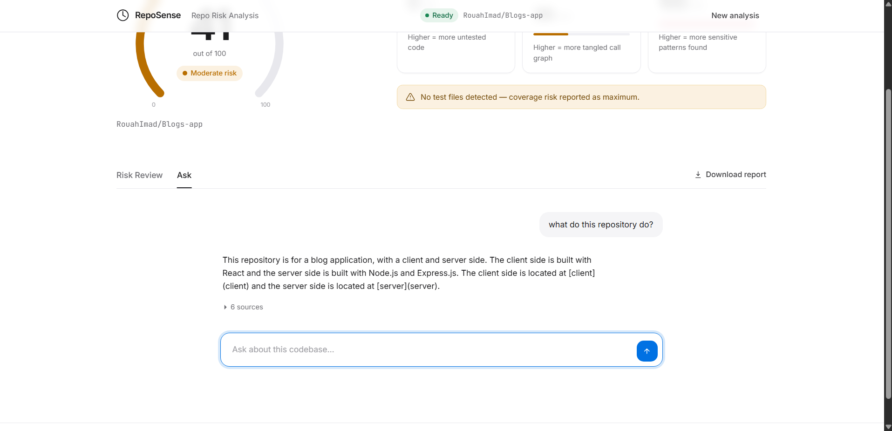

# RepoSense 🧠🔍
> Your repo. Understood. Reviewed. Ready.

RepoSense is an AI-powered developer tool built on **IBM Bob** that combines deep codebase intelligence with automated risk analysis — giving developers both understanding and actionable insights in one shot.

Built for the **IBM Bob Hackathon** (May 15–17, 2026) on [lablab.ai](https://lablab.ai).

---

## How it works

Paste a GitHub URL → RepoSense fetches every source file via the GitHub API, splits code into semantic chunks, embeds them into a local ChromaDB vector store, then runs two parallel pipelines: a **Q&A engine** (RAG + IBM Bob) for conversational codebase exploration, and a **risk review engine** (static analysis + IBM Bob enrichment) that produces an immediate 0–100 Risk Score. Everything is served through a FastAPI backend and rendered in a Streamlit UI. See [ARCHITECTURE.md](ARCHITECTURE.md) for the full component diagram.

---

## Screenshots

| Risk Score & Sub-scores | Codebase Q&A |
|---|---|
|  |  |

---

## What It Does

Drop a GitHub repo URL and RepoSense gives you two superpowers:

### 🧠 Module 1 — Repo Intelligence (Q&A)
- Ingests any GitHub repository via the GitHub API
- IBM Bob analyzes the full codebase with real context
- Exposes a conversational Q&A interface about the repo
- Ask anything: *"Where is auth handled?"*, *"What does this function depend on?"*, *"How does the payment flow work?"*

### 🔍 Module 2 — Automated Risk Review
- Runs on the same ingested repo — no extra setup
- Flags untested functions and missing test coverage
- Detects potential breaking points and risky dependencies
- Highlights security smells and anti-patterns
- Outputs a clean, structured risk report

> **Wow factor:** Immediately after ingestion, a **Risk Score (0–100)** appears — computed across test coverage, code complexity, and security. It's the first thing the user sees.

---

## Tech Stack

| Layer | Technology |
|---|---|
| AI Partner | IBM Bob |
| Backend | Python (FastAPI) |
| RAG Pipeline | LangChain |
| GitHub Integration | GitHub REST API (PyGithub) |
| Vector Store | ChromaDB |
| Embeddings | sentence-transformers/all-MiniLM-L6-v2 |
| Frontend | Streamlit |

---

## Quickstart (local)

1. **Prerequisites**
   - Python 3.10+
   - A GitHub Personal Access Token (only needed for private repos or to raise the rate limit)
   - IBM Bob API key (provided May 15 at hackathon kickoff — until then the Q&A will return a graceful "Bob not connected" message)

2. **Install**
   ```bash
   git clone <this-repo>
   cd reposense
   python -m venv .venv && source .venv/bin/activate   # Windows: .venv\Scripts\activate
   pip install -r requirements.txt
   cp .env.example .env
   # Fill in GITHUB_TOKEN (optional) and IBM_BOB_API_KEY / IBM_BOB_BASE_URL
   ```

3. **Verify with smoke scripts**
   ```bash
   python scripts/smoke_ingest.py   # Confirms ingestion + embedding works
   python scripts/smoke_review.py   # Confirms risk review + Markdown report
   ```

4. **Run**
   ```bash
   # Terminal 1 — backend
   uvicorn api.main:app --reload

   # Terminal 2 — UI
   streamlit run ui/app.py
   ```

5. **Use it.** Open http://localhost:8501, paste a GitHub URL, click **Ingest**. Wait ~15–30 seconds for the Risk Score.

---

## Project Structure

```
reposense/
├── README.md
├── ARCHITECTURE.md
├── OPUS_BRIEFING.md
├── SONNET_PROMPTS.md
├── requirements.txt
├── .env.example
│
├── ingestion/
│   ├── github_loader.py       # Fetch repo files via GitHub API
│   ├── chunker.py             # Split code into semantic chunks
│   └── embedder.py            # Embed chunks into ChromaDB
│
├── intelligence/
│   ├── context_builder.py     # Build repo summary for Bob
│   └── qa_engine.py           # RAG Q&A pipeline with IBM Bob
│
├── review/
│   ├── risk_analyzer.py       # Untested functions + breaking points
│   ├── security_scanner.py    # Security smells via IBM Bob
│   └── report_generator.py    # Risk score + Markdown report
│
├── api/
│   ├── main.py                # FastAPI app
│   └── routes/
│       ├── ingest.py          # POST /ingest
│       ├── qa.py              # POST /ask
│       └── review.py          # GET /review
│
├── ui/
│   └── app.py                 # Streamlit UI
│
└── demo/
    ├── DEMO_SCRIPT.md
    └── demo_repos.md
```

---

## API Endpoints

| Method | Endpoint | Description |
|---|---|---|
| POST | `/ingest` | Ingest a GitHub repo by URL |
| GET | `/status` | Poll ingestion/review status |
| POST | `/ask` | Ask a question about the ingested repo |
| GET | `/review` | Get the full risk review report (JSON or Markdown) |

---

## Hackathon Context

**Event:** IBM Bob Hackathon — lablab.ai  
**Dates:** May 15–17, 2026  
**Prize Pool:** $10,000  
**Challenge:** Build tools and workflows that developers would actually use, powered by IBM Bob  

**How IBM Bob is used:**
- Full repository context analysis (not just snippets)
- Intent-aware Q&A over real codebases
- Logic reasoning for risk detection
- Multi-step workflow automation for review pipeline

---

## Judging Criteria Alignment

| Criteria | How RepoSense addresses it |
|---|---|
| Application of Technology | IBM Bob is the core engine for both modules |
| Business Value | Solves real dev pain: onboarding & code risk |
| Originality | Combines Q&A + risk review in one unified pipeline |
| Presentation | Clean UI, structured report output, live demo |

---

## Author

Built solo by Youssef Jakimi — Software & AI Engineering Student  
IBM Bob Hackathon 2026
